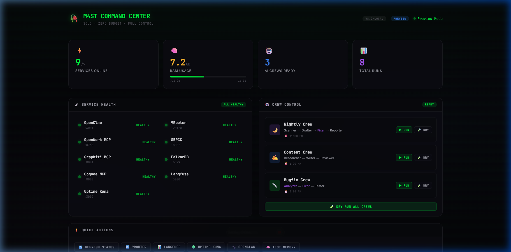

<div align="center">

# 🥀 WTF M4ST

**My Autonomous Stack for Tomorrow**

*Build once. Run forever. Pay nothing.*

Self-hosted AI agent infrastructure on a single 16GB Windows machine.
15+ Docker services · 7 MCP servers · 3 CrewAI crews · 11 LLM agents · Graph memory · Full observability.

[](LICENSE)
[](docker-compose.yml)
[](openwork-mcp/)
[](crews/)
[](crews/)
[](dashboard/)
[]()
[](scripts/setup_wsl2.sh)

</div>

---

## Table of Contents

- [What This Actually Is](#what-this-actually-is)
- [How It Works](#how-it-works)
- [9Router — LLM Provider Gateway](#-9router--llm-provider-gateway)
- [MCP Ecosystem](#-mcp-ecosystem)
- [AI Crews](#-ai-crews)
- [Tools Layer](#-tools-layer)
- [Chat Interfaces](#-chat-interfaces)
- [Memory Layer](#-memory-layer)
- [Observability](#-observability)
- [Dashboard](#-dashboard)
- [API Reference](#-api-reference)
- [Setup](#-setup)
- [Cost](#-cost)
- [How Is This Different?](#-how-is-this-different)
- [Roadmap](#-roadmap)

---

## What This Actually Is

A **personal AI automation platform** that combines:

- **15+ Docker services** — always-on core + on-demand tools, all on a single machine
- **7 MCP servers** — OpenWork, Graphiti, Cognee, Composio, Google Workspace, Exa Search, Pentest — plug into any MCP-compatible IDE
- **9Router LLM gateway** — one unified API endpoint to **20+ LLM providers** + **MITM proxy** that intercepts IDE LLM calls
- **3 CrewAI crews (11 agents)** — autonomous nightly pipelines for repo scanning, content creation, and bug fixing
- **Graph-based memory** — episodic memory (Graphiti) + knowledge graphs (Cognee) that persist across sessions
- **Full LLM observability** — every API call traced via Langfuse with token counts, latency, and cost breakdowns
- **On-demand tools** — Crawl4AI/Scrapling web crawling, Pentest MCP (88 security tools), browser-use (gated automation)
- **Chat interfaces** — LibreChat (ChatGPT-like UI) + Perplexica (self-hosted AI search)
- **React Command Center** — monitor all services, trigger crews, view logs from one dashboard

The core idea: **own the orchestration, memory, tools, and observability locally** — plug in any LLM provider through 9Router with zero code changes.

<div align="center">

<br/><em>Command Center — 9 services monitored, crew control, logs, architecture map</em>
</div>

---

## How It Works

```
YOU (IDE / Telegram / WhatsApp)
 │
 ▼
9Router (:20128) ─── routes to ──→ 20+ LLM providers (swap freely, use free tiers)
 │
 ▼
OpenWork MCP (:8765) ─── FastAPI bridge ──→ triggers crews, serves dashboard, exposes APIs
 │
 ├─→ CrewAI Crews (3 crews, 11 agents)
 │     ├─ 🌙 Nightly:  Scanner → Drafter → Fixer → Reporter  → Telegram report
 │     ├─ ✍️ Content:  Researcher → Writer → Reviewer         → drafts/ directory
 │     └─ 🐛 Bugfix:   Analyzer → Fixer → Tester             → patch suggestions
 │
 ├─→ MCP Servers (7 total)
 │     ├─ OpenWork MCP (:8765) — bridge for IDE tools
 │     ├─ Graphiti MCP (:8001) — episodic graph memory
 │     ├─ Cognee MCP (:8000) — knowledge graph
 │     ├─ Composio MCP — 250+ app integrations (GitHub, Slack, Notion...)
 │     ├─ Google Workspace MCP — Gmail, Calendar, Drive
 │     ├─ Exa Search MCP — web search (1000 free/month)
 │     └─ Pentest MCP — 88 security tools (on-demand)
 │
 ├─→ Memory Layer
 │     ├─ Graphiti + FalkorDB (:6379) — episodic + semantic graph
 │     └─ Cognee — document → knowledge graph
 │
 ├─→ Chat Interfaces
 │     ├─ LibreChat (:3080) — ChatGPT-like UI, multi-model
 │     └─ Perplexica (:3010) — self-hosted AI search engine
 │
 ├─→ On-Demand Tools
 │     ├─ Crawl4AI (:11235) — web crawling + Scrapling
 │     ├─ Pentest MCP — 88 security tools (NET_RAW/NET_ADMIN)
 │     └─ browser-use — browser automation (Telegram-gated)
 │
 ├─→ Observability
 │     ├─ Langfuse (:3000) — LLM call tracing (OpenLit/OTEL)
 │     └─ Uptime Kuma (:3002) — health monitoring → Telegram alerts
 │
 ├─→ Scheduling
 │     └─ Windows Task Scheduler — triggers crews on cron
 │
 └─→ Outputs
       ├─ Telegram — nightly status reports + uptime alerts
       ├─ logs/automation_log.jsonl — structured crew execution logs
       └─ drafts/ — generated content ready for review
```

---

## 🔀 9Router — LLM Provider Gateway

9Router is the **routing brain** of the stack. One endpoint. Any provider. Zero vendor lock-in.

**Why this matters:**
- **One API key rotation** doesn't break all your crews
- **Rate limited on Groq?** Automatic fallback to Gemini or NVIDIA
- **Need privacy?** Route through Ollama — fully offline, no data leaves your machine
- **Swap models** via `.env` — no code changes needed

| Provider | Best Free Models | Tier | Best For |
|----------|-----------------|------|----------|
| **Groq** | Llama 3.3 70B, Llama 4 Scout, Gemma 2 | Free (rate-limited) | ⚡ Fastest inference |
| **Google** | Gemini 2.5 Flash, Gemini 2.5 Pro | Free (generous limits) | 🧠 Best free reasoning |
| **NVIDIA NIM** | Llama 3.1 405B, Mixtral, CodeLlama | 1000 free credits | 🏋️ Largest free models |
| **Mistral** | Mistral Small, Codestral | Free tier | 💻 Code generation |
| **Cerebras** | Llama 3.3 70B, Llama 3.1 8B | Free tier | 🚀 Ultra-fast inference |
| **SambaNova** | Llama 3.3 70B, DeepSeek R1 | Free tier | ⚡ Hardware-accelerated |
| **Cohere** | Command R+, Command R | Free trial | 📄 RAG + retrieval |
| **Together AI** | Llama 3.3, Qwen 2.5 72B | $1 free credit | 🔧 Fine-tuning support |
| **OpenRouter** | 100+ models from all providers | Varies | 🔄 Meta-router |
| **DeepSeek** | DeepSeek V3, DeepSeek R1 | $0.028/1M tokens | 🧮 Cheapest deep reasoning |
| **OpenAI** | GPT-4o mini | Pay-as-you-go | 🌐 Widest ecosystem |
| **Anthropic** | Claude 3.5 Sonnet (via SEPCC proxy) | Pay-as-you-go | 📝 Best long-context |
| **Ollama** | Any local model (Llama, Mistral, Phi) | Free (self-hosted) | 🔒 Fully offline / private |

**MITM Proxy (`:20129`):** 9Router can intercept LLM calls from **any IDE** (Antigravity, Cursor, Windsurf) transparently. Install the CA cert → set system proxy → all IDE traffic routes through 9Router for tracing + model swapping.

> **Zero vendor lock-in.** Every crew talks to 9Router, not directly to providers. Swap the entire LLM backend in one env var change.

---

## 🤖 AI Crews

Three autonomous CrewAI pipelines run on schedule. Each crew is a **sequential chain** — agents pass structured results to the next.

### 🌙 Nightly Crew — `crews/nightly_crew.py`
**Schedule:** 11:00 PM daily &nbsp;|&nbsp; **Output:** Telegram report + `logs/`
```
Scanner [fast] → Drafter [fast] → Fixer [deep] → Reporter [fast]
```
Scans GitHub repos for issues, PRs, dependency alerts → drafts social content → attempts automated fixes → compiles Telegram report.

### ✍️ Content Crew — `crews/content_crew.py`
**Schedule:** 1:00 AM daily &nbsp;|&nbsp; **Output:** `drafts/content_YYYYMMDD.md`
```
Researcher [fast + Exa Search] → Writer [fast] → Reviewer [fast]
```
Researches AI/cybersecurity/open-source trends via Exa Search API → drafts LinkedIn/Twitter posts in dark terminal aesthetic → reviews against persona guidelines for overclaims.

### 🐛 Bugfix Crew — `crews/bugfix_crew.py`
**Schedule:** 3:00 AM daily &nbsp;|&nbsp; **Output:** `logs/` + patch suggestions
```
Analyzer [deep] → Fixer [deep] → Tester [fast]
```
Analyzes failed test logs and error traces → writes minimal localized patches → runs pytest verification.

#### Agent Tiers

| Tier | Speed | Use Case | Default Model |
|------|-------|----------|---------------|
| **`[fast]`** | ~2s/response | Scanning, drafting, reviewing, reporting | Best free-tier via 9Router |
| **`[deep]`** | ~5s/response | Code analysis, patch writing, reasoning | Best reasoning model via 9Router |

> Configure via `MODEL_FAST` / `MODEL_DEEP` env vars. Both route through 9Router — change provider without touching crew code.

#### All 11 Agents

| Crew | Agent | Role | Tier |
|------|-------|------|------|
| 🌙 Nightly | **Scanner** | Scans repos for issues, PRs, security alerts | `[fast]` |
| 🌙 Nightly | **Drafter** | Drafts social content from scan results | `[fast]` |
| 🌙 Nightly | **Fixer** | Attempts automated patches for flagged issues | `[deep]` |
| 🌙 Nightly | **Reporter** | Compiles Telegram status report | `[fast]` |
| ✍️ Content | **Researcher** | Finds technical trends via Exa Search | `[fast]` |
| ✍️ Content | **Writer** | Drafts LinkedIn/Twitter posts | `[fast]` |
| ✍️ Content | **Reviewer** | Audits tone and checks overclaims | `[fast]` |
| 🐛 Bugfix | **Analyzer** | Root-cause analysis from logs/traces | `[deep]` |
| 🐛 Bugfix | **Fixer** | Writes minimal code patches | `[deep]` |
| 🐛 Bugfix | **Tester** | Runs pytest, validates patches | `[fast]` |

All crews support **dry run mode** (`--dry-run`) — simulates the full pipeline without making API calls.

Every crew run is **automatically traced** in Langfuse via OpenLit/OTEL — token counts, latency, cost per agent.

---

## 🔗 MCP Ecosystem

7 MCP (Model Context Protocol) servers — plug the entire stack into any MCP-compatible IDE (Antigravity, Cursor, Claude Code, Windsurf).

| MCP Server | Transport | What it provides |
|------------|-----------|-----------------|
| **OpenWork MCP** | HTTP `:8765/mcp` | Crew triggers, health checks, RAM monitoring, log queries |
| **Graphiti MCP** | SSE `:8001/sse` | Read/write episodic graph memory |
| **Cognee MCP** | HTTP `:8000` | Query knowledge graphs, ingest documents |
| **Composio MCP** | Cloud | 250+ app integrations — GitHub, Slack, Notion, Linear, Jira, Google Apps |
| **Google Workspace MCP** | Local | Gmail, Calendar, Drive — OAuth-based |
| **Exa Search MCP** | Built into CrewAI | Web search with 1000 free queries/month |
| **Pentest MCP** | Docker (on-demand) | 88 security tools — nmap, sqlmap, nikto, gobuster, etc. |

**IDE Config (Antigravity / Cursor):**
```json
{
  "mcpServers": {
    "m4st-local": { "url": "http://localhost:8765/mcp" },
    "m4st-memory": { "url": "http://localhost:8001/sse" },
    "composio": { "url": "https://connect.composio.dev/mcp" }
  }
}
```

> Your IDE gets access to graph memory, crew triggers, 250+ app integrations, and 88 security tools — all through MCP.

---

## 🛠️ Tools Layer

On-demand tools that spin up when needed, shut down when done — zero idle resource waste.

### Crawl4AI + Scrapling
Web crawling with anti-detection and structured data extraction.
```bash
# Start (Linux/WSL2)
./scripts/start_crawl.sh start      # → http://localhost:11235

# Start (Windows)
.\scripts\start_crawl4ai.ps1 -Action start

# Stop when done
./scripts/start_crawl.sh stop       # Container auto-removed (--rm)
```
> ⚠️ **CVE-2026-26216** (CVSS 10.0) — always use v0.8.9+ (patched image auto-pulled).

### Pentest MCP (88 Security Tools)
Full offensive security toolkit via MCP — nmap, sqlmap, nikto, gobuster, dirb, hydra, and more.
```bash
# Start (requires NET_RAW + NET_ADMIN capabilities)
docker run -d --name pentest-mcp \
  --cap-add=NET_RAW --cap-add=NET_ADMIN \
  --network m4st_m4st \
  chfle/Pentest-MCP-Server

# Stop after use
docker stop pentest-mcp && docker rm pentest-mcp
```

### browser-use (Telegram-Gated)
Browser automation via AI — **always requires explicit Telegram approval** before execution. Never runs autonomously.
```bash
docker run --rm -it browser-use/browser-use
```

### Exa Search
AI-native web search API used inside CrewAI Content Crew. 1000 free queries/month.
- No Docker container needed — built into `crewai-tools` as `ExaSearchTool`
- Set `EXA_API_KEY` in `.env` — free key at [exa.ai](https://exa.ai)

---

## 💬 Chat Interfaces

Two self-hosted chat UIs — both route through 9Router for model flexibility.

### LibreChat (`:3080`)
ChatGPT-like multi-model interface with conversation history, search, and file uploads.
- **6 providers pre-configured**: Groq, DeepSeek, OpenRouter (100+ models), Gemini, Cerebras, SambaNova
- Routes through 9Router for unified model access
- Backed by MongoDB (conversation storage) + Meilisearch (full-text search)

### Perplexica (`:3010`)
Self-hosted AI search engine — like Perplexity.ai but running on your machine.
- Powered by SearxNG for web crawling
- Uses 9Router for LLM inference
- Completely private — no search data leaves your machine

---

## 🧠 Memory Layer

The stack has **persistent, queryable memory** — not just logs.

| Service | Type | What It Stores |
|---------|------|---------------|
| **Graphiti MCP** | Episodic memory | Conversations, decisions, context from past interactions |
| **Cognee MCP** | Semantic memory | Ingested documents → knowledge graph with relationships |
| **FalkorDB** | Graph database | Backend for Graphiti — stores nodes and edges |

**How memory works:**
- **Write:** Agents write context to Graphiti during crew runs (`/graphiti/write`)
- **Query:** Future runs can query past decisions (`/memory/query?type=conversation`)
- **Ingest:** Cognee processes documents into queryable knowledge graphs (`/cognee/query`)
- **Embeddings:** Generated via free-tier API through 9Router

> Agents don't start from scratch every run — they build on accumulated knowledge.

---

## 📡 Observability

Full audit trail for every LLM call in the system.

### Langfuse (self-hosted)
- **Every LLM call** traced — model, provider, tokens in/out, latency, cost
- **Crew execution timelines** — see which agent took how long
- **Cost analytics** — track spend per crew, per agent, per day
- Connected via **OpenLit → OTEL** pipeline (already wired in all crew code)

### Uptime Kuma
- **9 service health monitors** — checks every 30 seconds
- **Telegram alerts** — instant notification when any service goes down
- **Uptime history** — track reliability over time

> Between Langfuse traces and `automation_log.jsonl`, every action is auditable.

---

## 🖥️ Dashboard

React/Vite Command Center — dark terminal glassmorphism design system.

Built with **6 reusable components, 5 custom React hooks, 8 page sections.**

| Feature | Description |
|---------|-------------|
| **Service Health** | Live status dots for all 9 Docker services |
| **RAM Gauge** | Real-time Docker container memory via `docker stats` |
| **Crew Control** | Trigger any crew with ▶ Run / 🧪 Dry Run buttons |
| **Log Viewer** | Timestamped crew execution logs with color-coded crew badges |
| **Architecture Map** | Interactive 5-layer system diagram with hover effects |
| **Toast Notifications** | Real-time feedback on all actions |
| **Preview Mode** | When backend is offline, displays realistic mock data — UI stays alive and interactive |

**Design:** `#050508` background, glassmorphism cards, green accent palette, `Inter` font, micro-animations.

```bash
cd dashboard && npm install && npm run dev    # Dev: localhost:5173
cd dashboard && npm run build                  # Prod: served at :8765/dashboard
```

---

## 🔌 API Reference

OpenWork MCP exposes these endpoints at `:8765`:

| Method | Endpoint | Auth | Description |
|--------|----------|------|-------------|
| `GET` | `/health` | — | Service health for all 9 services |
| `GET` | `/api/ram` | — | Docker RAM usage per container |
| `GET` | `/api/logs?limit=25` | — | Recent crew execution logs |
| `GET` | `/api/system-info` | — | System metadata (version, platform, crew list) |
| `POST` | `/agent/run` | Token | Trigger a crew (`dry_run` param supported) |
| `POST` | `/execute` | Token | Execute shell command in container |
| `POST` | `/memory/query` | Token | Query Graphiti (conversation) or Cognee (code) |
| `POST` | `/graphiti/write` | Token | Write to Graphiti graph memory |
| `POST` | `/cognee/query` | Token | Query Cognee knowledge graph |
| `GET` | `/dashboard` | — | Serves the React Command Center |

**Example:**
```bash
# Check service health
curl http://localhost:8765/health

# Trigger nightly crew (dry run)
curl -X POST http://localhost:8765/agent/run \
  -H "X-M4ST-Token: your-token" \
  -H "Content-Type: application/json" \
  -d '{"crew": "nightly_crew", "params": {"dry_run": true}}'
```

<details>
<summary>Example /health response</summary>

```json
{
  "status": "healthy",
  "services": {
    "openclaw": "healthy",
    "ninerouter": "healthy",
    "falkordb": "healthy",
    "graphiti-mcp": "healthy",
    "cognee-mcp": "healthy",
    "langfuse": "healthy",
    "uptime-kuma": "healthy"
  }
}
```
</details>

---

## 🚀 Setup

### Requirements
- Windows 10/11 with WSL2 + Docker Desktop
- 16GB RAM (all services are mem-limited via Docker Compose)
- Node.js 18+ (dashboard)
- Python 3.11+ with CrewAI (crews)
- API keys: at minimum one free-tier key (Groq or Gemini)

### Quick Start

```bash
# 1. Clone
git clone https://github.com/m4stanuj/wtf-m4st.git
cd wtf-m4st

# 2. Configure
cp .env.example .env
# Required: GROQ_API_KEY (free) or GEMINI_API_KEY (free)
# Optional: DEEPSEEK_API_KEY, NVIDIA_NIM_API_KEY, TELEGRAM_BOT_TOKEN

# 3. Start the stack
docker compose up -d

# 4. Build dashboard
cd dashboard && npm install && npm run build && cd ..

# 5. Verify everything is running
curl http://localhost:8765/health
# → {"status": "healthy", "services": {...}}
```

### Automated Setup
```powershell
# Full Windows bootstrap (installs WSL2, Docker, Python, Node, everything)
.\scripts\bootstrap_windows.ps1
```

### Run Crews
```bash
# Dry run — simulates everything, no API calls
python crews/nightly_crew.py --dry-run

# Live run — real API calls, real outputs
python crews/nightly_crew.py
```

### Troubleshooting

| Issue | Fix |
|-------|-----|
| Docker containers OOM | Increase Docker Desktop memory limit to 16GB in Settings → Resources |
| WSL2 using too much RAM | Create `%UserProfile%\.wslconfig` with `[wsl2] memory=8GB` |
| 9Router can't reach providers | Check API keys in `.env` and run `curl http://localhost:20128/dashboard` |
| Crews fail with auth errors | Verify `GROQ_API_KEY` or `GEMINI_API_KEY` is valid and not expired |

---

## 📁 Project Structure

```
wtf-m4st/
├── crews/                    # CrewAI multi-agent crews
│   ├── nightly_crew.py       #   Scanner → Drafter → Fixer → Reporter
│   ├── content_crew.py       #   Researcher → Writer → Reviewer
│   └── bugfix_crew.py        #   Analyzer → Fixer → Tester
├── dashboard/                # React/Vite Command Center
│   ├── src/components/       #   GlassCard, StatusDot, Button, Badge, RamBar, Toast
│   ├── src/hooks/            #   useHealth, useRam, useLogs, useCrewRunner, useToast
│   ├── src/sections/         #   Header, StatsRow, ServicesPanel, CrewPanel, etc.
│   └── vite.config.js        #   API proxy to backend (:8765)
├── openwork-mcp/             # FastAPI backend
│   ├── main.py               #   9 API endpoints + dashboard serving
│   └── Dockerfile
├── scripts/                  # 16 automation scripts
│   ├── bootstrap_windows.ps1 #   Full automated setup
│   ├── health_check*.ps1/sh  #   Service health monitoring
│   ├── nightly_telegram_report.py  # Telegram report sender
│   ├── setup_wsl2.sh         #   WSL2 + Docker setup
│   ├── setup_task_scheduler.ps1    # Crew cron scheduling
│   └── ...
├── perplexica/               # Self-hosted search engine config
├── librechat/                # LibreChat config
├── docker-compose.yml        # 9-service stack (all mem-limited)
├── docs/                     # Screenshots + demo assets
└── .env.example              # All environment variables documented
```

---

## 💰 Cost (default free-tier config)

| Layer | Monthly cost |
|-------|-------------|
| LLM inference — fast agents (free tier) | **$0** |
| LLM inference — deep agents (optional paid) | **~$0.50** |
| Embeddings (free tier) | **$0** |
| 9 Docker services (self-hosted) | **$0** |
| Cloud infrastructure | **$0** |
| **Total** | **$0 – $0.50/month** |

> Runs entirely on free-tier LLM APIs by default. Upgrade to paid models anytime via 9Router — no code changes needed. Switch to Ollama for **$0 with complete privacy**.

---

## 🤔 How Is This Different?

| | **WTF M4ST** | AutoGPT / AgentGPT | LangChain Templates |
|---|---|---|---|
| **Infrastructure** | Self-hosted Docker stack | Cloud-dependent | Cloud-dependent |
| **LLM provider** | Any (via 9Router) | Usually OpenAI only | Usually OpenAI only |
| **Memory** | Persistent graph memory | Session-only | Vector DB (no graph) |
| **Observability** | Full Langfuse tracing | None built-in | Optional |
| **Cost** | $0–0.50/month | $20+/month (GPT-4) | Pay-per-call |
| **Vendor lock-in** | Zero | High (OpenAI) | Medium |
| **Offline mode** | Yes (Ollama) | No | No |

---

## 🗺️ Roadmap

- [ ] GitHub Actions CI pipeline for automated dry-run tests
- [ ] Webhook endpoint for real-time GitHub event triggers
- [ ] Crew result → Graphiti memory auto-persistence
- [ ] Multi-machine deployment with Docker Swarm
- [ ] Ollama auto-setup for fully offline mode
- [ ] Dashboard: per-agent Langfuse trace viewer
- [ ] Dashboard: crew scheduling UI (currently via Task Scheduler)

---

## 🙏 Acknowledgments

Built on the shoulders of incredible open-source projects:

[CrewAI](https://github.com/joaomdmoura/crewai) · [Langfuse](https://github.com/langfuse/langfuse) · [FalkorDB](https://github.com/FalkorDB/FalkorDB) · [Graphiti](https://github.com/getzep/graphiti) · [Cognee](https://github.com/topoteretes/cognee) · [Uptime Kuma](https://github.com/louislam/uptime-kuma) · [Vite](https://github.com/vitejs/vite) · [FastAPI](https://github.com/tiangolo/fastapi)

---

<div align="center">

**Built solo by [@m4stanuj](https://github.com/m4stanuj) · Berlin Mode 🥀**

*If this helped you or inspired something — star it. That's the only payment I accept.*

</div>
